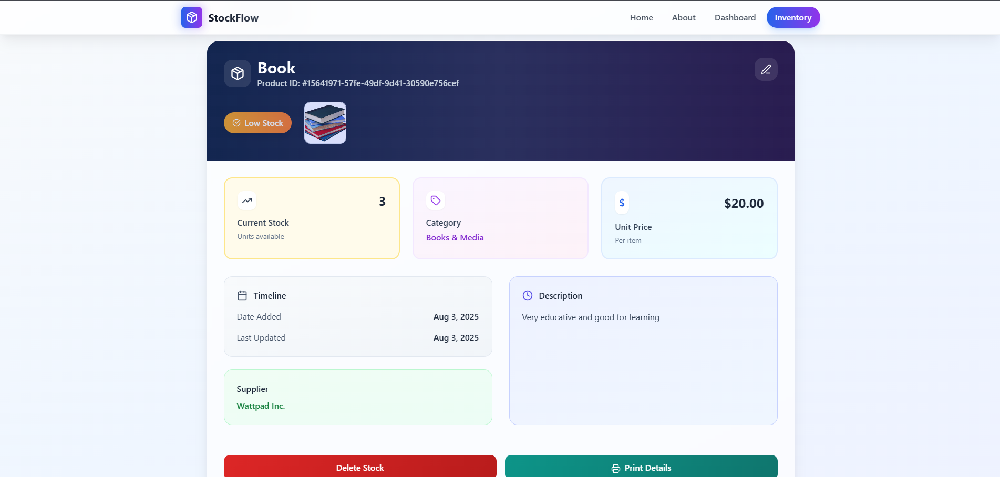

# 📦 StockFlow — Business Inventory Manager

**StockFlow** is a modern and user-friendly inventory management system designed to help businesses efficiently track and manage stock, monitor item trends, and keep records up-to-date. Built with React, Tailwind CSS, and local state management via Context API, StockFlow is lightweight yet feature-rich.

---

## 🔍 Features

* ✅ **Dashboard Overview**
  Real-time visualizations of total items, stock levels, monthly additions, and low-stock alerts.

* 📊 **Analytics & Charts**
  Pie and Line charts for visual representation of quantity distribution and inventory growth over time.

* 📋 **Inventory Listing**
  Interactive table view of all inventory with:

  * Search and clear functionality
  * Filter by date, category and stock status
  * Edit/Delete actions
  * Export to PDF

* ➕ **Add, Edit & Delete Items**
  Seamless modals for managing inventory records.

* 🧾 **Detailed Inventory View**
  Full-page view showing all item information, queried directly by ID.

* 💾 **Local Persistence**
  Items are stored using `localStorage` to maintain data across sessions without a backend.

  ## ✨ Features

### 📊 **Core Functionality**
- **Real-time Inventory Tracking** - Monitor stock levels, movements, and updates instantly
- **Smart Dashboard** - Comprehensive overview with analytics and key metrics
- **Product Management** - Add, edit, and organize inventory items with ease
- **Stock Alerts** - Automated notifications for low stock and reorder points
- **Search & Filter** - Advanced filtering and search capabilities

### 🎨 **Modern User Experience**
- **Responsive Design** - Seamless experience across desktop, tablet, and mobile
- **Glassmorphism UI** - Contemporary design with backdrop blur effects
- **Smooth Animations** - Micro-interactions and transitions for enhanced UX
- **Intuitive Navigation** - Clean, modern header with mobile-first approach

### 🔧 **Technical Excellence**
- **Fast Performance** - Built with Vite for lightning-fast development and builds
- **Type Safety** - Full TypeScript support for robust code quality
- **Modern CSS** - Tailwind CSS for maintainable and scalable styling
- **Component Architecture** - Modular, reusable React components
- **State Management** - Efficient state handling with contextAPI (useContext)

---

## 🚀 Getting Started

### Prerequisites

* Node.js ≥ 14.x
* npm or yarn

### Installation

```bash
git clone https://github.com/Dev-Rodiyat/StockFlow.git
cd StockFlow
npm install
```

### Run Locally

```bash
npm run dev
# or
yarn dev
```

---

## 🛠️ Tech Stack

* **React** – Frontend framework
* **Tailwind CSS** – Styling
* **Recharts** – Data visualization (charts)
* **Lucide-react** – Icons
* **date-fns** – Date formatting
* **Context API** – State management

---

## 🖼️ Screenshots

| Dashboard               | Inventory Page            | Item Details            |
| ----------------------- | ------------------------- | ----------------------- |
|  |  |  |

---

## 📁 Project Structure

```bash
stockflow/
├── src/
│   ├── components/                # Reusable UI components
│   │   ├── Header/                # Navigation header
│   │   ├── Footer/            
│   │   └── Layout/             
│   ├── pages/                     # Route pages
│   │   ├── Home/                 
│   │   ├── About/                
│   │   ├── Dashboard/             # Dashboard components
│   │   ├── Inventory/             # Inventory management
│   │   └── InventoryDetails/      # Inventory details
│   ├── contexts/                  # contextAPI for state management
│   ├── modals/                    # CRUD operation modals
│   └── styles/                    # Global styles
├── public/                        # Static assets
└── docs/                          # Documentation
```

---

## 🎯 Roadmap

### Phase 1 - Core Features ✅
- [x] Modern responsive header
- [x] Basic inventory management
- [x] Dashboard overview
- [x] Mobile navigation

### Phase 2 - Enhanced Features 🚧
- [ ] Advanced analytics dashboard
- [ ] Barcode scanning integration
- [ ] Export/Import functionality
- [ ] Multi-location support

### Phase 3 - Advanced Features 📋
- [ ] API integration
- [ ] User authentication
- [ ] Role-based permissions
- [ ] Real-time notifications
- [ ] Advanced reporting

## 📦 Future Improvements

* 🔐 Authentication & role-based access
* 🌐 Backend & database integration
* 🧮 Bulk import/export (CSV, Excel)
* 📈 More detailed analytics and reports

---

## 🙏 Acknowledgments

- Thanks to the React team for the amazing framework
- Tailwind CSS for making styling enjoyable
- Lucide for the beautiful icon set
- The open-source community for inspiration and support


---

## 👨‍💻 Author

**\[Rodiyat Olajide]**
Full-Stack web developer
[X](x.com/Dev_Rodiyat) | [LinkedIn](https://www.linkedin.com/in/rodiyat-olajide-71b737329/)
