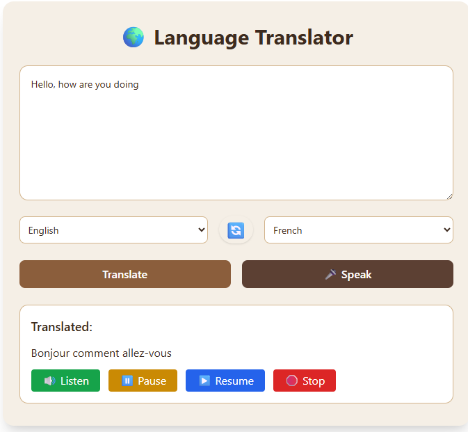
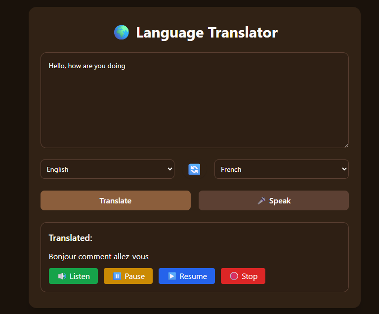

# 🌍 HiTranslate

HiTranslate is a modern, voice-powered language translator app that lets users **speak**, **see**, and **hear** translations in real-time. Built for language learners, travelers, and multilingual teams, the app supports voice input, history tracking, and text-to-speech — all with a sleek, responsive interface and dark mode support.

---

## ✨ Features

* 🎤 **Speech-to-Text Input** – Speak instead of typing
* 📝 **Text Translation** – Translate typed text between many languages
* 🔊 **Text-to-Speech Output** – Hear translated content with natural-sounding voices
* 📜 **Translation History** – View, search, and replay previous translations
* 🌐 **Flag Icons** – Visual language identification with country flags
* 🌓 **Light/Dark Mode** – Elegant UI that adapts to your theme
* 📥 **Download History** – Export translation history as a `.txt` file
* ⏯️ **Control Buttons** – Pause/resume/stop for audio playback

---

## 🚀 Technologies Used

* **React + Vite** – Frontend framework & dev environment
* **Tailwind CSS** – Utility-first styling
* **Framer Motion** – Seamless animations and transitions
* **React Router** – Client-side routing
* **Rapid API / Translation API** – Language translation and speech features

---

## 📁 Project Structure

```
src/
├── components/        # Reusable components (e.g., Footer, Header, FlagIcon)
├── pages/             # Page-level components (Home, Translate, History, About)
├── hooks/             # Custom hooks for voice & translation logic
├── assets/            # Images, flag icons, etc.
├── App.jsx            # Root component
└── main.jsx           # Entry point
```

---

## 📸 Screenshots

>  

---

## ⚙️ Getting Started

1. **Clone the repository:**

```bash
git clone https://github.com/Dev-Rodiyat/HiTranslate.git
cd HiTranslate
```

2. **Install dependencies:**

```bash
npm install
```

3. **Run the app locally:**

```bash
npm run dev
```

---

## 📄 Available Scripts

* `npm run dev` – Run the app in development
* `npm run build` – Build for production
* `npm run preview` – Preview the production build

---

## 🙋‍♀️ FAQ

* **Is it free?**
  Yes! All features are free to use.

* **Is history stored online?**
  No, all data is stored locally in your browser.

* **Does it support offline translation?**
  No, an internet connection is required for translation and voice features.

---

## 📫 Contact

Built with ❤️ by \[Rodiyat Olajide]
Feel free to reach out for collaboration or questions.
